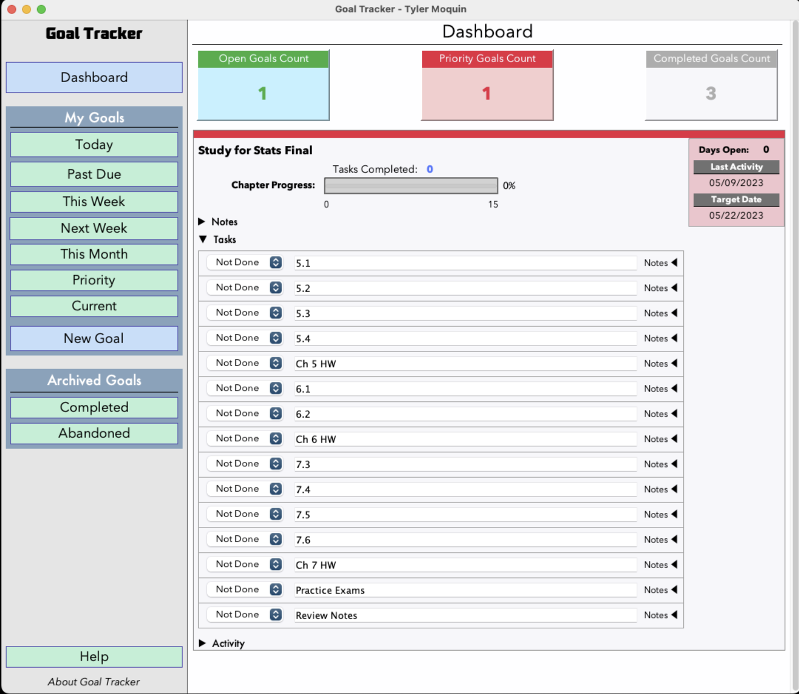

# GoalTracker
GoalTracker is an application designed to help users maintain and track goals.

## Issue
GoalTracker assists users in creating and managing various types of goals. The application allows the user to specify the type of goal, any deadline, and the attributes associated with the particular type of goal they are creating. The goal types currently supported are as follows:

*Accumulation Goals* are goals where you are aiming to accrue a certain amount. For example, if your goal was to set aside $500.00 over the next year to pay for a new synthesizer, that would be an Accumulation goal. Goal Tracker lets you add amounts towards your target at any time, and will automatically mark the goal as accomplished when the target is reached.
 
*Binary Goals* are goals that are either done or not done. For example, if you want to visit the Pacific Ocean some day, that would be a Binary goal, since you've either done it or you haven't.

*Numeric Goals* are goals that can be measured by a single numeric value. For example, if you want to work out three times in the next week, or you want to reach a weight of 150 lbs, that would be a Numeric goal. Goal Tracker lets you specify the updated value at any time, and will automatically mark the goal as accomplished when the target is reached.

*Task List Goals* are goals that consist of many done/not-done tasks. For example, if you needed to complete 25 homework problems for your Physics class, you could create a Task List goal, entering the problem numbers on separate lines, and Goal Tracker will treat these tasks as a group of sub-goals. Once you have completed all of the tasks within a Multi-Atomic goal, the goal will be marked as accomplished.


#### Running from terminal
```
1 Clone the repository to a local drive, then build the Maven project located in /GoalTracker/src/
2 cd GoalTracker/src/
3 java GoalTracker

```
### Operations
Please see the PDF document which contains a run-through of how to use the application, [here:](https://github.com/plusplusminusminus/CS151-GoalTracker/blob/172e191bd651d99213495b667d52b1b6df08e3e9/20230509%20Tyler%20Moquin%20-%20CS151%20Final%20Project.pdf).

Here is a sample screenshot:


#### References
```
All code within this project was created by Tyler Moquin. No AI assistance or borrowing from others was done.


